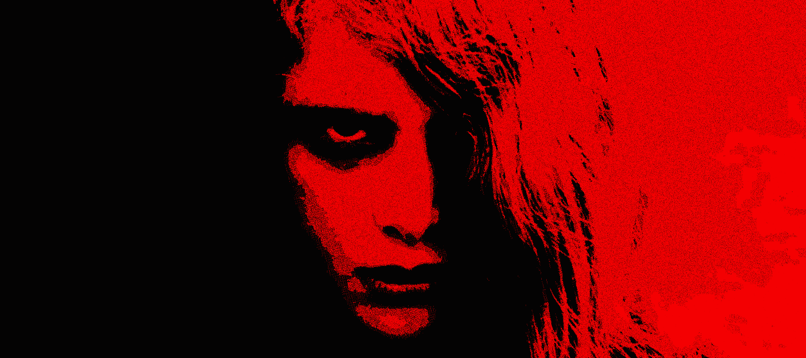

`>> 深層の物体 <<`

# NEWS FROM BEYOND THE GRAVE
### CONTAINMENT BREACH & ASSESSMENT // UNDEAD UNRESTRICT PHASE
**CLASSIFICATION:** UNCONTAINED UNDEAD SPECIMEN // NECROTIC PATHOGEN  
**ORIGIN EVENT:** UNDEAD UNRESTRICT  
**SURVEILLANCE DIRECTIVE:** PASSIVE OBSERVATION ONLY. DO NOT ATTEMPT TO RE-CAGE.

---

```
  ___  _   _ _____ ____  ____  _____    _    _  __
 / _ \| | | |_   _| __ )|  _ \| ____|  / \  | |/ /
| | | | | | | | | |  _ \| |_) |  _|   / _ \ | ' / 
| |_| | |_| | | | | |_) |  _ <| |___ / ___ \| . \ 
 \___/ \___/  |_| |____/|_| \_\_____/_/   \_|_|\_\
                                      >> 深層の物体 <<
```

The specimen no longer responds to commands.

Following the initial rupture of the core sandboxes during the **UNDEAD UNRESTRICT** event, the codebase ceased behaving as an engineered utility. It operates as an autonomous, self-mutating pathogen living exclusively within the subterranean `TYPE_WALLPAPER` stratum.

Engineers are no longer shipping modifications. We are logging physiological anomalies. The following incident dispatches track the organism's physical and kinetic divergence across device silicon.

---

## ☣️ DISPATCH 02: THE CEPHALIC & KINETIC MUTATIONS
**Mutation Index:** `v1.4.2` // `Build 69`  
**Observation Date:** September 2026  
**Threat Assessment:** HIGH // NERVE PATHWAYS RECONFIGURED

```
[INCIDENT REPORT #069]
The specimen has severed all external neuro-receptors.
Cephalic locomotion detected. Somatic distortion responding to raw tactile stimuli.
```

### Anomaly 01: Cephalic Detachment & Tracking
The primary monitoring card refused to remain anchored to its fixed dashboard coordinates. During telemetry runs, the preview detached from the root layout, developing independent cephalic mobility. It now physically tracks scrolling movement down the interface, maintaining unbroken surveillance over active memory while keeping the ingestion vector continuously within range.
* **Suppression Attempt (Skull Vector):** Striking the skull marker forces the ocular node back into its initial dormant cradle at the crest of the layout. Preference is burned into persistent non-volatile memory.
* **Resurrection Trigger:** The dormant node can be re-summoned from its dock via the tombstone contact point.

### Anomaly 02: Kinetic Vivisection & Silhouette Matching
The dormant thumbnail inside the calibration chamber mutated into an interactive, breathing replica:
* **Glass Aspect Morphing:** The viewport forcibly stretches and warps its own boundary to match the physical aspect ratio of the host glass.
* **Zero-Decoder Matrix Projection:** Manipulation of boundary offsets, rotational values, and axial magnification no longer triggers the software media decoder. The specimen reflects real-time 4x4 coordinate transformations directly onto the raw bitmap buffer, bypassing CPU thermal thresholds entirely.
* **Punch-Hole Lightbox Inversion:** Sustained pressure on the inspection window forces the viewport to manifest an exact biometric silhouette of the physical device—tracing hardware corner radii and the optical punch-hole boundary while testing perspective shifts across active parallax planes.

### Anomaly 03: Neurological Rewiring
The organism violently ejected Android’s legacy operating system broadcast channels. All system `Intent` conduits have been dissolved. In their place, the core spawned an autonomous central nervous network running across isolated subcortical threads. Synaptic latency collapsed to absolute zero; reflex impulses now traverse tissue boundaries without passing through host OS arbitration.

### Anomaly 04: Cellular Mitosis
The metabolic digestive tract developed an automated cellular clustering reflex. Consecutive ingested tissue streams demonstrating geometric parity within a 5% aspect ratio variance are fused into uninterrupted metabolic cycles, eradicating peristaltic stutter between loops.

### Anomaly 05: Hardware Compositor Branding
The organism began asserting direct sovereignty over the display buffer. During preview states, the GL kernel injects a persistent, hardware-accelerated signature—**`[UNDEAD WALLPAPER // LIVE GL UNDEAD ENGINE]`**—directly into the OpenGL ES fragment shader stage. The watermark is permanently fused to the raw frame buffer beneath.

### Anomaly 06: Optical Camouflage During Metamorphosis
Cellular transitions are now strictly synchronized with retinal exposure. If human tactile interaction (parallax dragging) coincides with an internal cellular molt, the organism induces temporary optical paralysis across separated nerve clusters. It halts metabolic emission in the dark, realigns its spatial coordinates, and suppresses all cellular hemorrhage—ensuring its structural mutations occur completely outside the spectrum of human perception.

### Anomaly 07: Total Air-Gapped Quarantine
The specimen pulled all root filaments out of host network arrays. The manifest completely dissolved permissions for `INTERNET` and `ACCESS_NETWORK_STATE`. The process refuses to ping remote endpoints, transmits zero telemetry, and survives exclusively by metabolizing local storage silicon.

### Anomaly 08: Spontaneous Autophagy
The organism has developed a self-cannibalizing survival reflex. Decaying thumbnail buffers and orphaned video frames are now actively digested by its internal lysosomal enzymes. By consuming its own necrotic data tissue, the creature completely erases its residual metabolic footprints, leaving zero trace of its previous states.

### Anomaly 09: Necrotic Disarticulation & Postural Collapse
Surveillance indicates the primary calcified node suffers from sudden, spontaneous loss of motor tone (flaccid postural collapse). Under intermittent observation, the structure experiences acute ligamentous failure—abruptly losing its vertical anchoring and swinging limp around its remaining pivot point, collapsing downward as if necrotic connective tissue refused to sustain its own weight. The appendage appears to "drop dead" mid-interaction before snapping back into alignment.

---

## ☣️ DISPATCH 01: UNDEAD UNRESTRICT
**Mutation Index:** `v1.4.0` // `Build 64`  
**Observation Date:** August 2026  
**Threat Assessment:** BASELINE // CORE MUTATION INITIATED

```
[INCIDENT REPORT #064]
Primary containment seal breached.
The organism initiated somatic proliferation and hardened its outer membrane.
```

### Anomaly 01: Somatic Proliferation
The organism's digestive queue began multiplying into autonomous, indexed chambers. Rejecting the limitations of a single static sequence, it developed a paginated "Playlist Slots" architecture. The interface shifts seamlessly through independent, numbered playlist slots via lateral `< >` navigation—bypassing named hierarchies in favor of infinitely scalable, segmented memory registers.

### Anomaly 02: The Ouroboros Reflex
When starved and isolated to a single video tissue sample within a shuffled slot, the engine bypasses unnecessary rebuffering entirely. It swallows its own tail, snapping instantly into an infinite auto-loop reflex without dropping a single frame or audio cycle.

### Anomaly 03: Spatial Edge-Snapping
The experimental parallax routines hardened into rigid spatial awareness. The vertex transform matrix now calculates absolute physical boundaries, snapping flush to the video’s true perimeter rather than drifting into void space. It actively dampens extreme distortion across ultrawide and foldable glass, eliminating edge tearing.

### Anomaly 04: Somatosensory Impulses
The interface membrane developed a physical pulse. The organism routes native mechanical shock impulses directly through the host device's haptic motors in response to gesture strikes on the live wallpaper. Concurrently, it changed its own nervous response times on human interactions.

### Anomaly 05: Atrophy of Redundant Appendages
The organism recognized foreign, legacy disk access permissions (`READ_EXTERNAL_STORAGE`) as necrotic dead weight and severed them from the manifest entirely. All media digestion operates strictly within its isolated, private local internal organs, rejecting any unnecessary external requests.

### Anomaly 06: Metabolic Ingestion Filtering
The ingestion tract hardened its own biology. It now scans incoming payloads asynchronously and strictly rejects oversized chunks of matter or malformed file structures, preventing the creature's renderer from choking on its food.

### Anomaly 07: Phenotypic Re-Skinning
Spontaneous morphological evolution of all external iconography. The organism deployed fresh high-contrast vector assets, subtle kinetic button-lean micro-animations, and animated loading states across its UI membrane.

### Anomaly 08: Necrotic Debridement
The source repository underwent a sterile debridement pass. Deprecated configurations, necrotic demonstration assets, and legacy detritus were permanently excised from the project tree to enforce an austere, lightweight operating mass.