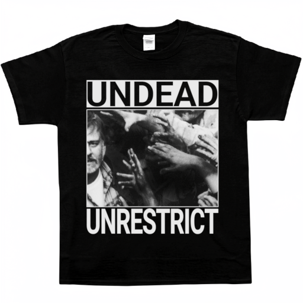

# UNDEAD // UNRESTRICT: Physical Deployment 

> ⚠️ **STATUS: PHYSICAL ASSETS SEIZED**
>
> Due to recent supply chain interceptions and the physical seizing of pre-pressed UndeadWallpaper apparel shipments, centralized distribution has been permanently terminated. All merchandise deployment is now fully decentralized. You must manufacture this asset yourself.

  

This document outlines the manufacturing specifications for deploying the official apparel. This is a strict 1-color process engineered specifically for dark cotton substrates. Do not attempt digital Direct-to-Garment (DTG) printing; the provided asset is optimized exclusively for physical mesh extraction.

## Pre-Press Specifications
* **Target Substrate:** 100% Cotton, Heavyweight (Black)
* **Print Method:** Silk-Screen (1-Color, High-Opacity White Ink)
* **Asset Resolution:** 3438x3941 (1:1 Hard-edged rasterized pixels, nearest-neighbor typography & extracted halftone matrix)
* **Master Stencil:** [`undead_white_ink_master.png`](assets/undead_white_ink_master.png) (Alpha-channel extracted, corner registration marks included)

  
   
  <em>Transparency Film Stencil (Click to inspect full 3438x3941 Master PNG)</em>

## Hardware Requirements
* **Mesh Count:** 156 to 230 mesh (US) / 60T to 90T (Metric). (Lower mesh will flood the halftone dots; higher mesh will choke high-viscosity white plastisol).
* **Squeegee:** 70 Durometer single-blade or 70/90/70 triple-durometer (firm edge for crisp halftone shearing).
* **Platen Tack:** Water-based platen adhesive or mist spray to prevent garment shifting.
* **Ink:** High-opacity white plastisol or high-solid water-based (HSA) white.

## Emulsion & Exposure
1. **Film Output:** Print [`undead_white_ink_master.png`](assets/undead_white_ink_master.png) onto a transparent acetate film using a high-density black ink printer.
   > **Note:** While the master file displays white pixels on transparency for visual display on black shirts, transparency film must be printed as a **Film Positive (100% opaque black ink / Dmax > 3.0)** so it blocks UV light during screen exposure. Do not allow RIP software to apply secondary halftones; the master file is pre-processed with hard-edged pixels.
2. **Alignment:** Use the four corner registration marks to align the film squarely onto the screen mesh. 
3. **Exposure:** Coat the screen with dual-cure photo emulsion. Expose the film to the emulsion under a UV vacuum unit.
4. **Washout:** Wash out the unexposed emulsion using pressurized water. The black-printed silhouette from the film positive leaves behind unexposed emulsion that dissolves away, translating directly to open mesh pores. Tape off the registration marks before printing.

  
   
  <em>Pre-Press Inset: (Left) 1:1 raw binary halftone extraction without RIP filtering. (Right) Corner registration bullseye target.</em>

## Printing & Curing
1. **Platen Setup:** Tack the dark substrate down squarely to the printing platen using platen adhesive to prevent fabric shifting during the stroke.
2. **Off-Contact:** Calibrate an **off-contact gap of 1.5mm to 3mm** (roughly the thickness of two coins) between the screen and garment. This ensures the mesh snaps off cleanly behind the stroke without smudging the delicate halftone dots.
3. **Ink Deposit:** Flood the screen with white ink, then execute a firm, smooth 45-degree squeegee pull to deposit the ink layer through the open mesh.
4. **Flash Cure (Optional Print-Flash-Print):** If greater opacity is desired on dark fabric, flash-cure the ink surface with a heat gun or flash dryer until gelled (~100°C–110°C, dry to the touch) and apply a second print stroke. 
5. **Final Cure:** Cure the garment thoroughly at **160°C (320°F)** to fully polymerize the ink into the cotton fibers. Perform a gentle stretch test once cooled to verify full cure.

## Physical Copyleft (GPLv3)
The UndeadWallpaper visual assets are licensed under the GNU General Public License v3.0. This copyleft explicitly extends to physical manifestations. If you screen-print, distribute, or modify this apparel, you are legally obligated to provide the source-resolution PNGs and manufacturing instructions to anyone who asks. Corporate gatekeeping of this merchandise is strictly prohibited.
