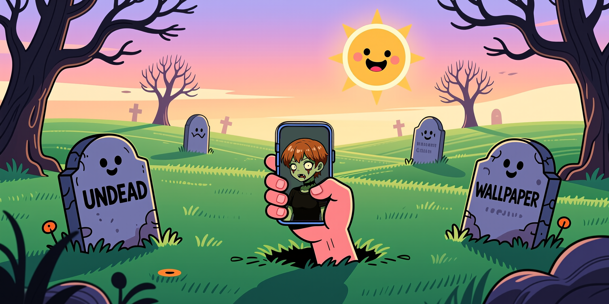

***

# UndeadWallpaper 🧟‍♀️📱

**Your phone screen is boring. Let's make it undead.**

Tired of static backgrounds? UndeadWallpaper is a free, balls-to-the-wall Android app that brings your screen to life... or, well, *un-death* by letting you slap any of your favorite videos on it as a seamless, stutter-free live wallpaper.

## The Story Behind the Name

This isn't just a clever pun on "live" wallpaper. The name **UndeadWallpaper** is personal. After a long, forced hiatus from coding, this project was the first sign of life—the moment a passion that was buried came clawing its way back to the surface. This app isn't just "live"; it's a symbol of a creator coming back from the dead. It's **undead**, because some things are just too stubborn to die.

## Features ✨

*   **The New Engine (OpenGL Power):** We ripped out the old guts and replaced them with a custom OpenGL pipeline. It's smoother, faster, and lets you do things standard Android wallpapers can't.
*   **God-Mode Controls:** Don't just set a video; *own* it. Scale, stretch, zoom, rotate, and position your wallpaper exactly how you want it. Too dark? Crank the brightness. It's your screen, do what you want.
*   **One-Shot Mode:** Want a "Live Photo" vibe? Set your video to play once and freeze on the final frame. Perfect for cinematic intros.
*   **Zombillie is Here:** Fresh install? We got you covered with a default Zombillie animation so your screen isn't naked while you look for your own clips.
*   **Buttery-Smooth Looping:** Powered by ExoPlayer, your video loops will be so seamless, you'll forget where they even begin (o˘◡˘o).
*   **Unleash Your Own Videos:** No pre-packaged crap. Grab any video straight from your phone's storage and make it your backdrop.
*   **Quick-Draw Recents:** A handy list of your last-used videos, so you can swap vibes on the fly.
*   **Audio On/Off Toggle:** Want your wallpaper to make some noise? Flip the switch. Want silent beauty? We got you.
*   **100% Free & Open Source:** No ads, no bullshit, no microtransactions. Ever. This is a passion project, and the code is open for all you brilliant weirdos to see.

## Getting Started (It's scary simple)

1.  **Pick Your Poison:** Tap the "Pick Video" button and choose your masterpiece.
2.  **Tweak It:** Use the new advanced settings to fit, fill, or stretch your video. Zoom in, move it around, make it perfect.
3.  **Smash the Button:** Like what you see in the preview? Hit that floating button and bring your screen to glorious un-life.

## Join the Horde! (Contribute & Connect)

This project clawed its way back from the dead, but it was the **community** that truly gave it a soul. The launch on Reddit was a whirlwind of incredible feedback, brilliant ideas, and amazing support. It's where the next chapter of this story is being written.

* Want to see what the horde is saying? **[Dive into the main feedback thread right here!](https://www.reddit.com/r/androidapps/comments/your_thread_id_here)**

Got your own ideas? Found a bug? Wanna make this thing even more badass? Contributions are not just welcome; they're celebrated!

* Spotted a glitch? Got a genius feature idea? **[Open an issue](https://github.com/maocide/UndeadWallpaper/issues/new/choose)** and let's talk about it.
* Wanna get your hands dirty with some code? **Fork the repo** and hit me with a pull request!

## License

This whole shebang is licensed under the **GNU General Public License v3.0**. Freedom for all!

## Download Now (Do it!)

*   **Google Play Store:** [From the Play Store](https://play.google.com/store/apps/details?id=org.maocide.undeadwallpaper)
*   **GitHub Releases:** [Grab the bleeding-edge APKs here!](https://github.com/maocide/UndeadWallpaper/releases/)

---

Thanks for checking out the project. Now go make something awesome. (,,•ω•,,)♡
