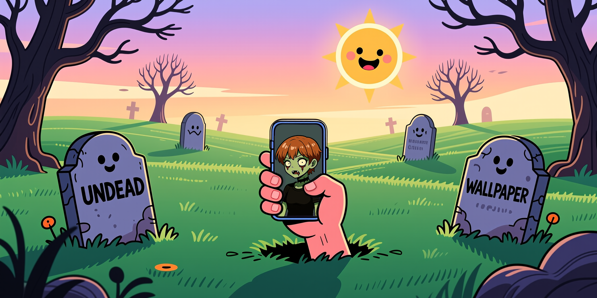

***

# UndeadWallpaper 🧟‍♀️📱

**Your phone screen is boring. Let's make it undead.**

Tired of static backgrounds? UndeadWallpaper is a free, balls-to-the-wall Android app that brings your screen to life... or, well, *un-death* by letting you slap any of your favorite videos on it as a seamless, stutter-free live wallpaper.

## The Story Behind the Name

This isn't just a clever pun on "live" wallpaper. The name **UndeadWallpaper** is personal. After a long, forced hiatus from coding, this project was the first sign of life... the moment a passion that was buried came clawing its way back to the surface. This app isn't just "live"; it's a symbol of a creator coming back from the dead. It's **undead**, because some things are just too stubborn to die.

## Features ✨

*   **The New Engine (OpenGL Power):** We ripped out the old guts and replaced them with a custom OpenGL pipeline. It's smoother, faster, and lets you do things standard Android wallpapers can't.
*   **God-Mode Controls:** Don't just set a video; *own* it. Scale it with professional modes (Fit, Fill, Stretch), then zoom, rotate, and position your wallpaper exactly how you want it. Too dark? Crank the brightness. Need it faster? Adjust the playback speed. Can't read your clock? Force your Status Bar icons to be White, Black, or Auto. It's your screen, do what you want.
*   **Interactive Playlist:** Your recent files are a fully drag-and-drop playground. Swipe to delete, reorder on the fly, tweak each wallpaper on its own, and hit `Loop All` or `Shuffle` modes for endless transitions between your favorite clips. 
*   **Smart Start Times:** Customize exactly what your wallpaper does when you unlock your phone. Resume where you left off, restart for that dramatic intro, or jump to a random frame because chaos is fun.
*   **One-Shot Mode:** Want a "Live Photo" vibe? Set your video to play once and freeze on the final frame. Perfect for cinematic intros.
*   **Zombillie is Here:** Fresh install? We got you covered with a default Zombillie animation so your screen isn't naked while you look for your own clips.
*   **Buttery-Smooth Looping:** Powered by ExoPlayer, your video loops will be so seamless, you'll forget where they even begin (o˘◡˘o).
*   **Unleash Your Own Videos:** No pre-packaged crap. Grab any video straight from your phone's storage and make it your backdrop.
*   **Audio On/Off Toggle:** Want your wallpaper to make some noise? Flip the switch. Want silent beauty? We got you.
*   **100% Free & Open Source:** No ads, no bullshit, no microtransactions. Ever. This is a passion project, and the code is open for all you brilliant weirdos to see.

## Recent Changes

This fork adds a few bigger playlist and wallpaper-control changes on top of the original app:

*   **Per-wallpaper settings:** Each wallpaper can now keep its own scaling mode, position, zoom, rotation, brightness, speed, enabled state, and loop count.
*   **Smarter playlist control:** Wallpapers can be disabled without being removed, and `Loop All` can respect per-item loop counts.
*   **Runtime cleanup:** Playlist playback now follows explicit item state instead of depending only on a saved URI and recent-files order.
*   **Simpler main screen:** The old main-screen `Advanced` accordion was removed so wallpaper-specific controls live in one place: the item settings dialog.

This set of changes was developed with assistance from OpenAI Codex.

## Getting Started (It's scary simple)

1.  **Pick Your Poison:** Tap the "Pick Video" button and choose your masterpiece.
2.  **Tweak It:** Open a wallpaper's settings from the playlist edit icon and make it fit, fill, stretch, zoom, rotate, or move exactly how you want.
3.  **Smash the Button:** Like what you see in the preview? Hit that floating button and bring your screen to glorious un-life.

### Keep It Alive (Disable Battery Optimizations) 🧟‍♂️
Some Android ROMs are absolutely ruthless. They will try to double-tap this app in the background to save a drop of battery, killing the decoders or the background service right when you need them. 

To keep your wallpaper running *smoothly* and truly *undead*, dive into your phone's app settings and **disable battery optimizations** for UndeadWallpaper. Tell the OS to back off and leave the dead alone; it's the perfect workaround for aggressive battery killers.

## Join the Horde! (Contribute & Connect)

This project clawed its way back from the dead, but it was the **people** that truly gave it a soul.

* Want to see what the horde is saying? **[Dive into the main feedback thread right here!](https://www.reddit.com/r/androidapps/comments/1nl2zwj/i_made_a_free_noads_opensource_app_that_lets_you/)**

Got your own ideas? Found a bug? Wanna make this thing even more badass? Contributions are not just welcome; they're celebrated!

* Spotted a glitch? Got a genius feature idea? **[Open an issue](https://github.com/maocide/UndeadWallpaper/issues/new/choose)** and let's talk about it.
* Wanna get your hands dirty with some code? **Fork the repo** and hit me with a pull request!

## License

This whole shebang is licensed under the **GNU General Public License v3.0**. Freedom for all!

## Download Now (Do it!)

*   **Google Play Store:** [From the Play Store](https://play.google.com/store/apps/details?id=org.maocide.undeadwallpaper)
*   **GitHub Releases:** [Grab the bleeding-edge APKs here!](https://github.com/maocide/UndeadWallpaper/releases/)

### The Graveyard Shift (Special Thanks) 🪦
Bringing a project back from the dead takes a village (or at least a few good souls). A big thanks to the people and projects that helped piece this monster together:

* **@kitsumed** - For contributing the GitHub Actions CI pipeline and providing brilliant technical insights.
* **Lucid** - For relentless testing, immense patience, and helping hunt down obscure OEM/custom OS engine crashes.
* **@sms1sis** - For the great brainstorming about resources and optimization.
* **Trick_Equipment_6938** - For sparking the original concept that eventually evolved into the v1.2.0 Dynamic Playlist Engine.
* **@AmazingKo** - For excellent feature suggestions that helped shape the development backlog.
* **Everyone** who has taken the time to report an issue, leave a review on the Play Store, or test a beta build. Your support keeps the undead alive!

---

Thanks for checking out the project. Now go make something awesome. (,,•ω•,,)♡
