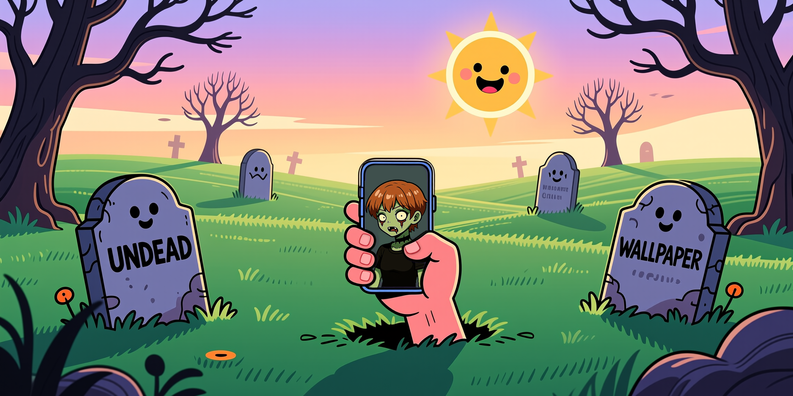
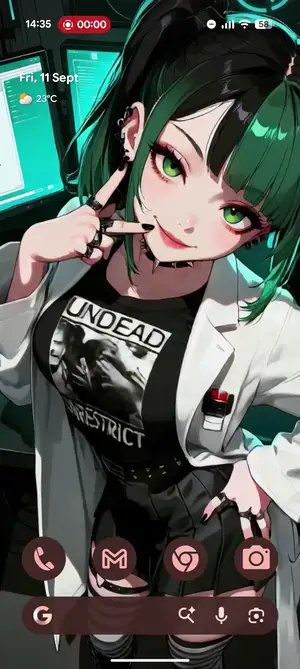
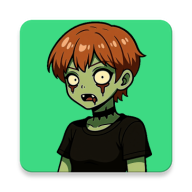
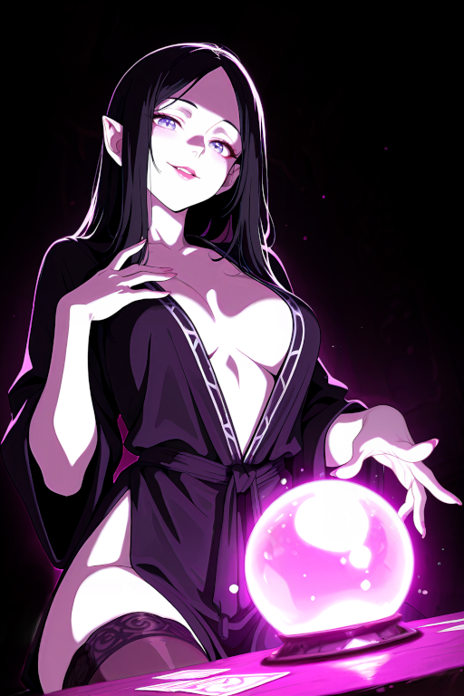

# UndeadWallpaper

### An OpenGL-transformed, ExoPlayer-driven, video live wallpaper engine.
###### No telemetry. No ads. It runs the media you feed it, when you feed it.

  

 

---

| Standard Distribution | Direct / Bootleg Pipeline | Underground News |
| :--- | :--- | :--- |
| **[GET IT ON GOOGLE PLAY](https://play.google.com/store/apps/details?id=org.maocide.undeadwallpaper)** Signed release build, managed updates. | **[VISIT MERCH STORE](#merch-store)** Cheap FOSS merch, handcrafted DLCs, raw APKs. | **[NEWS FROM BEYOND THE GRAVE](CHANGELOG.md)** Official news, only available here. |

---

## Origin

This project did not start as a roadmap. After a forced, extended hiatus from coding where the developer almost flatlined, this was the first pulse... a prototype built in a single morning that refused to stay buried. It is not just a live wallpaper. It is a symbol of coming back from the dead. Some things are just too stubborn to die. Some code doesn't just run. *It haunts*.

## Specifications

Is *live* cause is alive, *undead* cause is in between life and death continuously rapidly cycling, renders pure *gl* es, and in the end is just an *engine*. We do not explain. We state that cause why not and someone might ask.
It spends its un-life down in Android's lowest, darkest and most forgotten substrate...*WallpaperService*. Where legacy MediaPlayer instances often lay abandoned and forgotten, *ExoPlayer* and *OpenGL* instead started to coexist symbiotically—untamed, immortal and undisturbed.

**The Interface**
* **Material Zombie Theme:** Material 3 architecture. Custom dark theme, accordion menus, and tonal layouts.
* **Floating Preview Monitor:** The preview card detaches on scroll, keeping the live feed and video picker docked during dashboard navigation. Banished with the skull; resurrected via the tombstone.
* **Dynamic UI Extraction:** The engine extracts dominant color palettes from active media to theme the Android OS environment.
* **Tactile Response:** Haptic feedback integration. Custom double/triple tap gestures execute skip or pause commands directly from the home screen.

**The Guts**
* **Custom Graphics Pipeline:** Dedicated OpenGL + ExoPlayer backend. Hardware-accelerated transforms, positioning, and gapless loop transitions.
* **Agnostic Ingestion:** The engine is content-agnostic, not limited to sketchy anime loops. It renders the media you provide—from recorded drone footage to family pet videos to fully licensed anime loops. All file types are treated equally by the renderer.
* **Isolated Local Storage:** File I/O executes asynchronously via scoped isolated storage.
* **Video Parallax:** The engine intercepts launcher events, shifting perspective proportionally to the aspect ratio during scroll.

**Ultimate Control**
* **Live Matrix Calibration:** The Video Settings Sheet projects transforms onto a device-aspect thumbnail with maximum *performance*. Long-press engages the Lightbox Peek to frame the video against your hardware frame.
* **Per-Video Overrides:** Access the Video Settings Sheet to manipulate zoom, offset, rotation, playback speed, mirroring, brightness and volume for individual files.
* **Playlists Slots:** Paginated dashboard for playlist management. Loop All or Shuffle execution.
* **Smart Start States:** Define engine behavior on visibility acquired. Resume playback, jump to a random frame, or execute a one-shot cinematic intro that freezes on the final frame.
* **Licensing & Privacy:** Zero ads. Zero microtransactions. Zero network permissions. Public source code.

## Deployment

1. **Load:** Select local media via the official file picker.
2. **Execute:** Trigger the primary action button to deploy the render pipeline to the system home screen.
3. **Calibrate: (Optional)** Access advanced settings to scale, offset, and rotate. Live updates allow real-time home screen adjustments. 

### OS Interference (Battery Optimizations)

Certain Android ROMs aggressively terminate background decoders. The built-in Allow Background Performance card flags this behavior. Tap "Fix" to enter system settings and disable battery optimizations for the app. Tell the OS to back off.

> **Troubleshooting:** OEM limitations causing UI freezes or color mismatch? [Read the FAQ](FAQ.md).

## Merch Store
#### *"you can't kill what's already dead."*

| Preview |  Content | Specification & Origin | Status | Price |
| :---: | :--- | :--- | :--- | :--- |
|  | **[UWU v1.4.2 (｡• ω •｡) UNDEAD WALLPAPER UNRESTRICTED](https://github.com/maocide/UndeadWallpaper/releases/latest/)** | Native engine APK. Fits on 5 High-Density 3.5" floppy disks (spanning archive, 1.44 MB each). **DLC NOT included**. | `[AVAILABLE]` | 0.00 FOS$ |
|  | **[UNDEAD // UNRESTRICT OFFICIAL T-SHIRT](DIY_MERCH.md)** | High-DPI PNG FOSS Apparel. 0.0 BLOAT. GPLv3 Silk-Screening deployment guide available. | `[DIY ONLY // PHYSICAL SEIZED]` | 0.00 FOS$ |
|  | **SYBIL WAIFU // DLC LIVE WALLPAPER** | Artisanal generative loop. Executed via handcrafted ComfyUI node pipeline and encoded natively via PixelChopper. **Format Specs:** 1080p MP4. **Lore:** Interactive oracle imported from **[BACKLOG REAPER](https://github.com/maocide/BacklogReaper)**. **Notice:** Pending centralized platform age-verification clearance. | `[RESTRICTED // PENDING AGE CLASSIFICATION]` | 0.00 FOS$ |
|  | **QA TESTER ABBY // DLC LIVE WALLPAPER** | Artisanal generative loop. Executed via handcrafted ComfyUI node pipeline and encoded natively via PixelChopper. **Format Specs:** 1080p MP4. Engine pre-optimized. | `[TBA // INTERNAL TEST TRACK ONLY]` | 0.00 FOS$ |
|  | **[DIY DEVELOPER PERSONA](assets/profile.png)** | Hand-drawn (Paint Tool SAI) avatar deployment kit. Dated pre-Stable Diffusion era. | `[DEPLOYED]` | 0.00 FOS$ |

 

> **Physical Copyleft & Disclaimer (GNU GPLv3)**
>
> UndeadWallpaper and its associated visual assets are licensed under the GNU General Public License v3.0. We believe software copyleft naturally extends to physical manifestations. 
> 
> If you pull the repository, compile the engine, or screen-print this apparel, the same rules apply: you are legally obligated to provide the source code, the master PNGs, and the manufacturing instructions to anyone who asks. Closed-door corporate gatekeeping of these assets—digital or physical—is strictly prohibited.
>
> The software is provided strictly **"AS IS"**, without warranty of any kind. The engine is an offline, hardware-accelerated vessel—zero telemetry, zero cloud crutches. Lifecycles and decoder performance are governed entirely by your hardware and your OEM's background limits.

 

> **⚠️ DISCLOSURE**
> 
> LLMs may have been utilized to assist in the production or conceptualization of certain software or visual assets. However, all final architectural and artistic decisions were strictly enforced by demi-human intervention. No LLMs were harmed during production.
>
> Furthermore, all fictional entities, digital waifus, and anthropomorphic representations depicted herein are categorically 18 years of age or older at the time of drawing, editing or generating, regardless of spatial-temporal paradoxes, suspension of disbelief, or stylistic proportions.